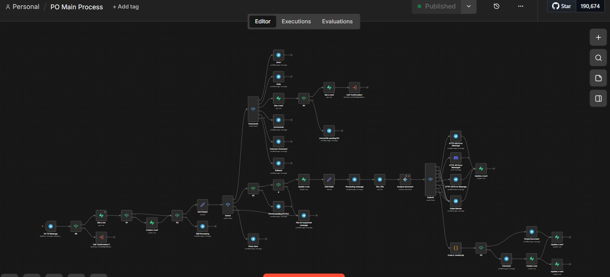
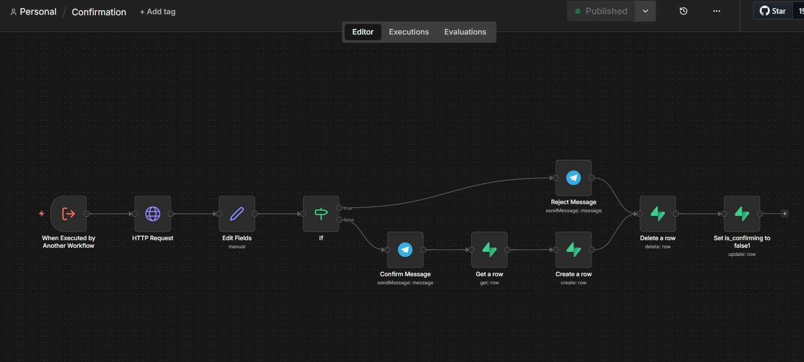

# 📦 PO Processing Telegram Bot

A Telegram bot that receives Purchase Order (PO) documents from suppliers, extracts structured order data using Google Gemini AI, and stores confirmed orders into Supabase, powered by n8n workflows.

---

## 🧠 Architecture Overview

The system is composed of two n8n workflows:

### 1. `PO Main Process` — Core Workflow
Handles the end-to-end PO processing pipeline. It receives incoming Telegram messages containing PO attachments (images or PDFs), forwards them to Google Gemini for AI-powered data extraction, then sends the extracted order summary back to the supplier via Telegram for confirmation. Based on the supplier's response, it either persists the order to Supabase or discards it.



### 2. `Confirmation` — Sub-Workflow
Handles the inline accept/reject button logic presented to the supplier after extraction. It listens for the supplier's Telegram callback query and returns the decision (accepted or rejected).



---

## ✨ Features

- Accepts PO documents as **images (JPG/PNG) or PDF** via Telegram
- Uses **Google Gemini AI** to extract structured PO data from any document format
- Sends extracted data back to the supplier for **inline confirmation** (Accept / Reject)
- Stores confirmed orders directly into **Supabase**
- Discards rejected or cancelled orders. Nothing is saved without approval

---

## 📋 Extracted PO Fields

The AI extracts the following structured JSON from each PO document:

```json
{
  "customer_name": "ABC Supermarket",
  "po_number": "PO-12345",
  "po_date": "2026-05-28",
  "delivery_date": "2026-06-01",
  "delivery_address": "Makati City",
  "items": [
    {
      "item_code": "CC-001",
      "description": "Gummy Bears 1kg",
      "quantity": 10,
      "uom": "CASE",
      "unit_price": 1200,
      "total": 12000
    }
  ],
  "confidence": "high, medium, or low",
  "confidence_reason": "one sentence on how is the confidence rated.",
}
```

---

## 🤖 Bot Commands

| Command | Description |
|---|---|
| `/start` | Welcome message and overview |
| `/help` | Usage instructions |
| `/commands` | List all available commands |
| `/cancel` | Cancel current pending PO |

---

## 🗄️ Supabase Schema

See [`supabase/schema.sql`](supabase/schema.sql).

---

## ⚙️ Environment Variables

| Variable | Description |
|---|---|
| `TELEGRAM_TOKEN` | Your Telegram bot token from [@BotFather](https://t.me/BotFather) |
| `N8N_WEBHOOK_URL` | Public URL where n8n is accessible |

Copy `.env.example` to `.env` and fill in your values:

```bash
cp .env.example .env
```

---

## 🚀 Running Locally

### Prerequisites
- [Docker](https://www.docker.com/) and Docker Compose
- Telegram bot token (from [@BotFather](https://t.me/BotFather))
- Google Gemini API key
- Supabase project
- Public URL for webhook (use [ngrok](https://ngrok.com/) for local dev)

### Steps

**1. Clone the repository**
```bash
git clone https://github.com/YanVillano/po-bot.git
cd po-bot
```

**2. Set up environment variables**
```bash
cp .env.example .env
# Edit .env with your actual values
```

**3. Start n8n**
```bash
docker-compose up -d
```

n8n will be available at `http://localhost:5678`

**4. Import the workflows**
- Open n8n at `http://localhost:5678`
- Go to **Workflows → Import from file**
- Import `workflows/Confirmation.json` first
- Then import `workflows/PO_Main_Process.json`

**5. Configure credentials in n8n**
- **Telegram API** — paste your `TELEGRAM_TOKEN`

**6. Set up Supabase**

Run the SQL in [`supabase/schema.sql`](supabase/schema.sql) in your Supabase SQL editor.

**7. Set the Telegram webhook**
```bash
curl -X POST "https://api.telegram.org/bot<YOUR_TOKEN>/setWebhook" \
  -H "Content-Type: application/json" \
  -d '{"url": "https://YOUR_PUBLIC_URL/webhook/YOUR_WEBHOOK_ID"}'
```

**8. Activate both workflows in n8n**

**9. Test — send `/start` to your bot on Telegram**

---

## 🐳 Docker

```bash
# Start
docker-compose up -d

# Stop
docker-compose down

# View logs
docker-compose logs -f n8n
```

---

## 🔁 Design Decisions

- **Google Gemini** was chosen as the AI backbone because it natively handles both image and PDF inputs, eliminating the need for a separate OCR or document-parsing step.
- **Supabase** was chosen for its real-time capabilities and auto-generated REST API, making it trivial to insert and query confirmed PO records from n8n without any custom server.
- **n8n** was chosen to orchestrate the entire workflow visually, avoiding the need for a dedicated backend service — the whole pipeline runs as connected workflow nodes.
